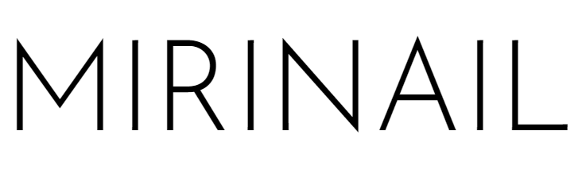
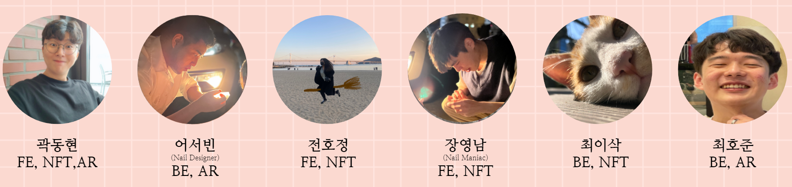
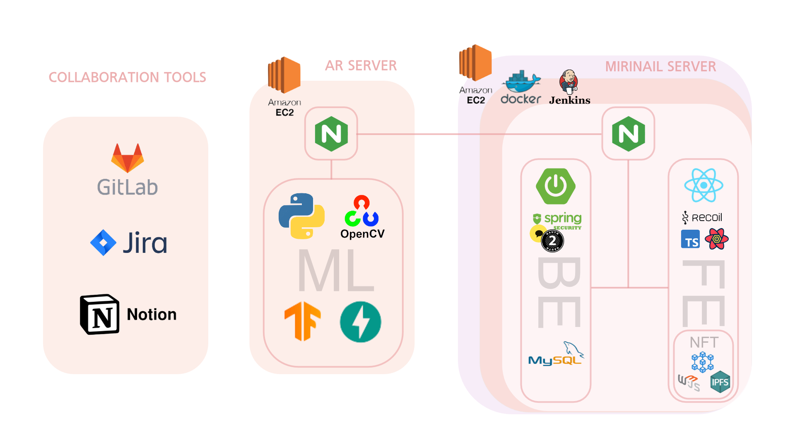
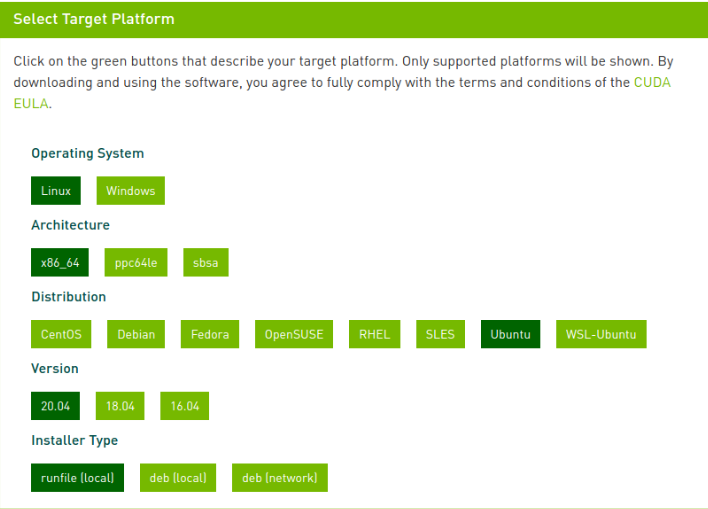
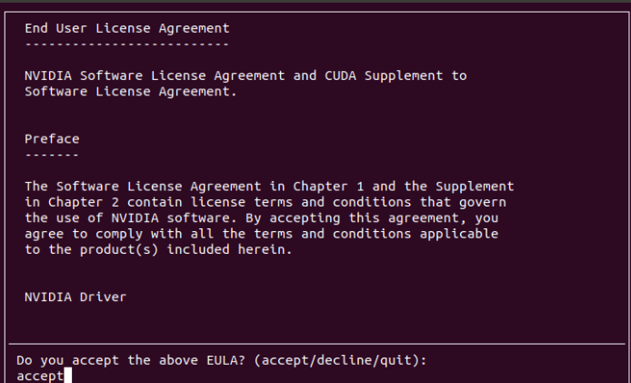
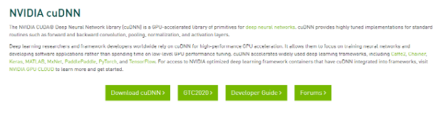

# MiriNail

<p align="center">
  
</p>

</br></br>

## 한 줄 소개
</br>

### **AR기술과 NFT를 이용한 네일 피팅 서비스**

</br></br>

## 기획배경

</br>

* 커져가는 네일시장
* 네일 시술 후 맘에 들지 않는 고객
* 고객 유치가 어려운 네일 샵
* 네일 디자인에 대한 저작권 의식 부재

</br></br>

## 기획의도

</br>

* 커져가는 네일시장에 맞춰 고객과 디자이너의 이어주는 서비스를 제공
* 고객들의 취향에 맞는 네일아트를 선택할 수 있는 서비스 제공


</br></br>

## 서비스 특징

</br>

* MiriNail은 Designer, Community 페이지를 통해 고객과 디자이너간의 원활한 소통 서비스를 제공합니다.
* MiriNail은 AR 기술을 통해 손톱위에 자신이 원하는 디자인의 네일아트 피팅서비스를 제공합니다.
* MiriNail은 블록체인 기술을 통해 디자이너의 네일아트를 NFT화 합니다.

</br></br>

## 프로젝트 팀원

</br>
<p align="center">
  
</p>


</br></br>

## 프로젝트 기간

</br>

### 2022.04.11 ~ 2022.05.20 ( 6주 )

</br></br>

## 주요 협업 툴

</br>

- Jira
- MatterMost
- GitLap
- [Notion](https://www.notion.so/MIRINAIL-33e8f8a0c76f4aed8a8e2f6998be4300)

</br></br>


## 서비스 아키텍쳐

</br>

<p align="center">
  
</p>


</br></br>

# 메인

</br>

## 메인페이지 

</br>

<p align="center">
  
</p>

</br>

 ### 1. 메인 페이지에서는 인기 네일아트 및 디자이너, 유저들의 커뮤니티 페이지를 간략하게 볼 수 있다.

</br></br>

## 검색 ( NavBar )

</br>

<p align="center">
  
</p>

</br>

### 1. 네브바의 검색창을 통해 디자이너를 검색 할 수 있다.
### 2. 검색한 디자이너의 페이지로 이동해 새소식, 문의 등을 할 수 있다.

</br></br>

# 네일아트

</br>

## 네일아트 목록
</br>

<p align="center">
  
</p>

</br>

### 1. 네브바를 통해 네일아트 목록으로 이동 할 수 있다.
### 2. 이동한 초기 페이지는  네일아트 전체를 보여주고 페이지네이션을 통해 여러 네일아트를 볼 수 있다.
### 3. 위쪽은 타입별, 색상별 필터링을 통해 크게 분류 하여 볼 수 있다.
### 4. 타입별에서는 3가지 타입으로 나누어 볼 수 있으며 최신순 인기순으로 정렬이 가능하다.
### 5. 색상별에서는 12가지 색상으로 나누어 볼 수 있으며 최신순 인기순으로 정렬이 가능하다.

</br></br>

## 네일아트 상세
</br>

<p align="center">
  
</p>

</br>

### 1. 위의 네일아트 목록에서 하나의 네일아트를 선택하여 상세보기를 할 수 있다.
### 2. 상세에서는 이름, 가격, 디자이너, 소개 등을 볼 수 있다.
### 3. AR 피팅하기를 통해 실제 나의 손톱에 네일아트를 올려 볼 수 있다.
### 4. 예약하기를 통해 원하는 날짜에 예약을 신청 할 수 있다.
### 5. 좋아요를 통해 마음에 드는 네일아트를 찜 할 수 있다.
### 6. 해당 디자이너의 다른 작품들을 볼 수 있다.
### 7. 해당 네일아트에 대한 리뷰를 확인 할 수 있다.
### 8. 해당 네일아트에 대해 1대1 문의를 할 수 있다.


</br></br>

## 네일아트 상세 - 예약

</br>

<p align="center">
  
</p>

</br>

### 1. 상세에서 예약 버튼을 누르게 되면 예약 페이지로 이동한다.
### 2. 달력에서 원하는 날짜를 선택하면 해당 날짜중에 예약 할 수 있는 시간이 표기된다.
### 3. 표기된 날짜에서 예약가능한 네일아트를 선택하고 요청사항을 적은 뒤 예약이 가능하다.

</br></br>

## 네일아트 AR 피팅

</br>

<p align="center">
  
</p>

</br>

### 1. 상세에서 AR 피팅하기 버튼을 누르면 네일아트 피팅 창이 뜬다.
### 2. 피팅 창에서 손을 올리게 되면 손톱을 인식하며 선택한 디자인의 이미지가 피팅된다.

</br></br>

# 디자이너 목록

</br>

<p align="center">
  
</p>

</br>

### 1. 디자이너 목록은 테마별, 전체 보기로 나뉜다.
### 2. 테마별 보기에서는 인기, 최신, 평점 높은 순으로 디자이너를 볼 수 있다.
### 3. 전체 보기에서는 등록된 디자이너를 모두 볼 수 있다.
### 4. 두 페이지 모두 각 디자이너를 클릭해 해당 디자이너의 페이지로 이동 할 수 있다.

</br></br>

# 마이 페이지

</br>

## 유저 마이 페이지

</br>

<p align="center">
  
</p>

</br>

### 1. 유저 마이페이지에서는 유저 본인의 기록을 볼 수 있다.
### 2. 예약 확인 페이지를 통해 본인이 예약한 예약들을 볼 수 있다.
### 3. 히스토리에서는 좋아요한 네일아트, 작성한 게시글, 작성한 리뷰, 문의 내역을 확인 할 수 있다.
### 4. 유저가 팔로우한 디자이너 목록을 확인 할 수 있다.

</br></br>

## 디자이너 등록

</br>

<p align="center">
  
</p>

</br>

### 1. 유저 마이페이지에서 디자이너 등록을 진행 할 수 있다.
### 2. 등록시에는 디자이너명, 연락처, 주소를 입력하고 사업자 등록증을 첨부해 등록 신청을 할 수 있다.

</br></br>

# 디자이너

</br>

## 네일아트 등록

</br>

<p align="center">
  
</p>

</br>

### 1. 네일아트 등록 시에는 썸네일 이미지, AR 이미지를 첨부 한다.
### 2. 기입 내용으로는 네일 타입, 색상, 세부색상, 가격, 소개글을 입력한다.
### 3. 등록 이후에는 블록체인 기술을 통해 ipfs 번호가 자동으로 등록된다.

</br></br>

## 새소식 작성

</br>

<p align="center">
  
</p>

</br>

### 1. 새소식 작성에서는 디자이너가 글을 올려 해당 페이지를 보는 유저들에게 공지를 할 수 있다.
### 2. 등록시에는 제목 작성, 이미지( 다중 첨부 가능) 첨부, 글 내용 작성 이후에 등록 할 수 있다.

</br></br>

## 문의 내역

<p align="center">
  
</p>

</br>

### 1. 문의 내역 페이지에서는 디자이너에게 들어온 문의 내역들을 확인 할 수 있다.
### 2. 들어온 문의에 대해서는 답변을 달 수 있다.

</br></br>

# 관리자

<p align="center">
  
</p>

</br>

### 1. 관리자는 디자이너 인증 신청 목록에서 승인, 거절을 통해 디자이너로 등록 시키거나 거절 할 수 있다.

</br></br>

# 커뮤니티

</br>

<p align="center">
  
</p>

</br>

### 1. 커뮤니티 페이지에서는 다른 유저들의 글을 확인 할 수 있다.
### 2. 올라온 글을 클릭해 댓글을 달아 소통 할 수 있다.
### 3. 작성하기 버튼을 통해 이미지를 올리고 글을 작성하여 소통 할 수도 있다.


</br></br>


# GPU 서버 설정

## 1. 그래픽 드라이버 설치
</br>

```
$ ubuntu-drivers devices
```
</br>

이후 드라이버 버전중 하나를 선택 하여 설치
</br>

```
$ sudo apt install nvidia-driver-570
```


</br>

## 2. cuda 11.2 설치
</br>

아래 링크에 접속하여 CUDA Toolkit 11.2를 선택
</br>

https://developer.nvidia.com/cuda-toolkit-archive

</br>

아래와 같이 선택

</br>



</br>

아래 명령어를 입력
</br>

</br>


</br>

명령어 실행 후 아래와 같은 창이 뜬다면

</br>

Continue 선택


</br>

다음처럼 에러가 난다면 gcc가 설치안되어 있는 상태 

</br>

 Failed to verify gcc version. See log at /var/log/cuda-installer.log for details.


</br>

개발을 위한 필수 프로그램을 설치하고 다시 실행

</br>

```
$ sudo apt-get install build-essential 
```

</br>
accept 입력 후, 엔터를 입력



</br>

Driver 항목에서 스페이스바 눌러서 체크 해제하고 , Install 항목에서 엔터를 입력</br>
(해당 사진은 Driver version이 460으로 표기 되지만 위에서 설치한 570에 맞춰서 설치)

</br>


</br>

문제 없이 설치되면 다음처럼 표기

</br>


</br>

다음 명령을 사용하여 CUDA Toolkit 관련 설정을 환경 변수에 추가하고  바로 적용

</br>

```
$ sudo sh -c "echo 'export PATH=$PATH:/usr/local/cuda-11.2/bin' >> /etc/profile"
$ sudo sh -c "echo 'export LD_LIBRARY_PATH=$LD_LIBRARY_PATH:/usr/local/cuda-11.2/lib64' >> /etc/profile"
$ sudo sh -c "echo 'export CUDADIR=/usr/local/cuda-11.2' >> /etc/profile"
$ source /etc/profile
```

</br>

설치가 잘되었는지 확인. 11.2 가 보여야 함

</br>

다음 명령어를 입력

</br>

```
$ nvcc -V
```

</br>

아래와 같이 보인다면 설치가 완료

</br>

```
nvcc: NVIDIA (R) Cuda compiler driver

Copyright (c) 2005-2020 NVIDIA Corporation

Built on Mon_Nov_30_19:08:53_PST_2020

Cuda compilation tools, release 11.2, V11.2.67

Build cuda_11.2.r11.2/compiler.29373293_0
```

</br>


## 3. cuDNN 8.1.0 설치

</br>

아래 링크에 접속

https://developer.nvidia.com/cudnn 

</br>
Download cuDNN을 클릭
</br>



</br>
계속 진행하려면 로그인 진행
</br>


</br>
라이센스에 동의한다고 체크하고( I Agree to the Terms of… ) 

Archived cuDNN Releases를 클릭 


</br>

목록에서 다음 항목을 클릭
</br>

```
Download cuDNN v8.1.0 (January 26th, 2021), for CUDA 11.0,11.1 and 11.2
```
</br>


다음 항목을 클릭 
</br>

```
cuDNN Library for Linux (x86_64)
```

</br>


다운로드 받은 파일을 압축풀어서 파일 복사

</br>

```
$ cd 다운로드

$ tar xvzf cudnn-11.2-linux-x64-v8.1.0.77.tgz

$ sudo cp cuda/include/cudnn* /usr/local/cuda/include

$ sudo cp cuda/lib64/libcudnn* /usr/local/cuda/lib64


$ sudo chmod a+r /usr/local/cuda/include/cudnn.h /usr/local/cuda/lib64/libcudnn*
```


</br>

링크를 다시 걸어줌

 </br>

```
$ sudo ln -sf /usr/local/cuda-11.2/targets/x86_64-linux/lib/libcudnn_adv_train.so.8.1.0 /usr/local/cuda-11.2/targets/x86_64-linux/lib/libcudnn_adv_train.so.8

$ sudo ln -sf /usr/local/cuda-11.2/targets/x86_64-linux/lib/libcudnn_ops_infer.so.8.1.0  /usr/local/cuda-11.2/targets/x86_64-linux/lib/libcudnn_ops_infer.so.8

$ sudo ln -sf /usr/local/cuda-11.2/targets/x86_64-linux/lib/libcudnn_cnn_train.so.8.1.0  /usr/local/cuda-11.2/targets/x86_64-linux/lib/libcudnn_cnn_train.so.8

$ sudo ln -sf /usr/local/cuda-11.2/targets/x86_64-linux/lib/libcudnn_adv_infer.so.8.1.0  /usr/local/cuda-11.2/targets/x86_64-linux/lib/libcudnn_adv_infer.so.8

$ sudo ln -sf /usr/local/cuda-11.2/targets/x86_64-linux/lib/libcudnn_ops_train.so.8.1.0  /usr/local/cuda-11.2/targets/x86_64-linux/lib/libcudnn_ops_train.so.8

$ sudo ln -sf /usr/local/cuda-11.2/targets/x86_64-linux/lib/libcudnn_cnn_infer.so.8.1.0 /usr/local/cuda-11.2/targets/x86_64-linux/lib/libcudnn_cnn_infer.so.8

$ sudo ln -sf /usr/local/cuda-11.2/targets/x86_64-linux/lib/libcudnn.so.8.1.0  /usr/local/cuda-11.2/targets/x86_64-linux/lib/libcudnn.so.8

```

</br>

새로 추가된 라이브러리를 시스템에서 찾을 수 있도록 하고 루트 디렉토리로 이동

</br>

```
$ sudo ldconfig

$ cd
```

</br>


설정이 제대로 되었는지 확인 ( 다음처럼 8.1.0이 표기되었는지 확인 )

</br>

```
$ ldconfig -N -v $(sed 's/:/ /' <<< $LD_LIBRARY_PATH) 2>/dev/null | grep libcudnn

libcudnn_adv_train.so.8 -> libcudnn_adv_train.so.8.1.0

libcudnn_adv_infer.so.8 -> libcudnn_adv_infer.so.8.1.0

libcudnn_ops_infer.so.8 -> libcudnn_ops_infer.so.8.1.0

libcudnn.so.8 -> libcudnn.so.8.1.0

libcudnn_ops_train.so.8 -> libcudnn_ops_train.so.8.1.0

libcudnn_cnn_train.so.8 -> libcudnn_cnn_train.so.8.1.0

libcudnn_cnn_infer.so.8 -> libcudnn_cnn_infer.so.8.1.0

```

</br></br>

# 빌드 및 배포에 필요한 정보

>## 메인서버
</br>

## 1. 주요 버전
```cmd
1. JVM : 1.8.0_192
2. Web Server : Nginx 1.18.0
3. WAS : Tomcat 9.0.45
4. Visual Studio : 1.64.2
5. IntelliJ : IntelliJ IDEA 2021.3.2 (community)
6. React : 17.02
7. NodeJS : 16.13.2
8. springBootVer : '2.6.4'
9. solidity : 0.8.12
10. web3js : 1.7.1
11. 기타 상세 버전 정보
    - React : package.json
    - SpringBoot : build.gradle
```

<br/>

## 2. Dockerfile / Frontend

```docker
FROM node:16.13.2 as build-stage
WORKDIR /app
COPY package*.json ./
RUN npm install
COPY . .
RUN npm run build

FROM nginx:stable-alpine as production-stage
COPY  ./nginx/nginx.conf /etc/nginx/conf.d/default.conf

COPY --from=build-stage /app/build /usr/share/nginx/html
CMD ["nginx", "-g", "daemon off;"]
```
</br>

## 3. nginx.conf / Frontend
```docker
server {
    listen 80;
    listen [::]:80;
	
    # server_name 도메인;
    server_name k6e101.p.ssafy.io;

		access_log /var/log/nginx/access.log;
		error_log /var/log/nginx/error.log;

    location / {
        return 301 https://$server_name$request_uri; # http 접속 시 https 로 자동 접속
    }
}

server {
	client_max_body_size 20M;
	listen 443 ssl;
	listen [::]:443 ssl;
	
	# server_name 도메인;
	server_name k6e101.p.ssafy.io;

	access_log /var/log/nginx/access.log;
	error_log /var/log/nginx/error.log;

	ssl_certificate /var/www/html/fullchain.pem;
	ssl_certificate_key /var/www/html/privkey.pem;

	root /usr/share/nginx/html;
	index index.html;

	location / {
		try_files $uri $uri/ /index.html;
	}

	location /api {
		proxy_pass https://k6e101.p.ssafy.io:8443;
	}

	location /nail {		
		proxy_http_version 1.1;
    	proxy_set_header Upgrade $http_upgrade;
    	proxy_set_header Connection "Upgrade";
    	proxy_set_header Host $host;
		proxy_pass http://k6e101.p.ssafy.io:8000;
	}

	location /websocket {
		proxy_http_version 1.1;
    	proxy_set_header Upgrade $http_upgrade;
    	proxy_set_header Connection "Upgrade";
    	proxy_set_header Host $host;
		proxy_pass http://k6e101.p.ssafy.io:8000;
	}
}
```
</br>

## 4. Dockerfile / Backend

```docker
FROM openjdk:8-jdk-alpine

# jar 파일 경로는 직접 입력해주세요.
COPY build/libs/backend-0.0.1-SNAPSHOT.jar app.jar

## 배포용 properties 실행 명령어
ENTRYPOINT ["java","-jar","app.jar","--spring.config.name=application-prod"]

# 만약 배포용 properties를 사용하지 않는다면
# Default properties 실행 명령어
# ENTRYPOINT ["java","-jar","app.jar"]
```

</br>

## 5. application-prod.properties / Backend

```docker
#it will be set build date by gradle. if this value is @build.date@, front-end is development mode
build.date=@build.date@

# nginx.conf ? Backend port? ????.
server.port=8443
# ???? ??
#server.address=localhost
server.servlet.contextPath=/
# Charset of HTTP requests and responses. Added to the "Content-Type" header if not set explicitly.
server.servlet.encoding.charset=UTF-8
# Enable http encoding support.
server.servlet.encoding.enabled=true
# Force the encoding to the configured charset on HTTP requests and responses.
server.servlet.encoding.force=true

#database
spring.jpa.hibernate.naming.implicit-strategy=org.springframework.boot.orm.jpa.hibernate.SpringImplicitNamingStrategy
spring.jpa.hibernate.naming.physical-strategy=org.springframework.boot.orm.jpa.hibernate.SpringPhysicalNamingStrategy
spring.jpa.hibernate.ddl-auto=update
spring.jpa.properties.hibernate.dialect=org.hibernate.dialect.MySQL57Dialect
spring.data.web.pageable.one-indexed-parameters=true
spring.datasource.url=jdbc:mysql://mirinail.com:3306/MIRINAIL?useUnicode=true&characterEncoding=utf8&serverTimezone=Asia/Seoul&zeroDateTimeBehavior=convertToNull&rewriteBatchedStatements=true
spring.datasource.driver-class-name=com.mysql.cj.jdbc.Driver
spring.datasource.hikari.username= { Mysql.userName }
spring.datasource.hikari.password= { Mysql.userPassword }

# SQL log show
spring.jpa.show.sql=true
spring.jpa.properties.hibernate.format_sql=true
logging.level.org.hibernate.type.descriptor.spi.BasicBinder=trace

# jwt
jwt.secret= { jwt.secret.key }
# unit is ms. 15 * 24 * 60 * 60 * 1000 = 15days
jwt.refreshTokenExpiration=1296000000
jwt.accessTokenExpiration=216000000

#logging
logging.file.name=./logging/nailart.log
logging.level.root=INFO
logging.level.com.samsung.security=DEBUG
logging.level.org.springframework.web=DEBUG
logging.level.org.apache.tiles=INFO
logging.level.org.sringframework.boot=DEBUG
logging.level.org.sringframework.security=DEBUG

# console Color
spring.output.ansi.enabled=always

#AWS S3 Cloud key
cloud.aws.credentials.accessKey= { AWS.S3.accessKey }
cloud.aws.credentials.secretKey= { AWS.S3.secretKey }
cloud.aws.stack.auto=false

# AWS S3 Service bucket
cloud.aws.s3.bucket=mirinail-bucket
cloud.aws.region.static=ap-northeast-2

# AWS S3 Bucket URL
cloud.aws.s3.bucket.url=https://s3.ap-northeast-2.amazonaws.com/mirinail-bucket

# file upload limit
spring.servlet.multipart.max-file-size=20MB
spring.servlet.multipart.max-request-size=20MB
spring.http.multipart.enabled=true 
spring.http.multipart.location= /upload

# kakao social login
spring.security.oauth2.client.registration.kakao.client-id={ kakao.client.id }
spring.security.oauth2.client.registration.kakao.client-secret={ kakao.client.secret }
spring.security.oauth2.client.registration.kakao.client-authentication-method=post
spring.security.oauth2.client.registration.kakao.authorization-grant-type=authorization_code
spring.security.oauth2.client.registration.kakao.redirect-uri=https://k6e101.p.ssafy.io:8443/login/oauth2/code/kakao
spring.security.oauth2.client.registration.kakao.scope=profile_nickname, profile_image, account_email, gender, age_range
spring.security.oauth2.client.registration.kakao.client-name=Kakao

# Provider
spring.security.oauth2.client.provider.kakao.authorization-uri=https://kauth.kakao.com/oauth/authorize
spring.security.oauth2.client.provider.kakao.token-uri=https://kauth.kakao.com/oauth/token
spring.security.oauth2.client.provider.kakao.user-info-uri=https://kapi.kakao.com/v2/user/me
spring.security.oauth2.client.provider.kakao.user-name-attribute=id

# token Key & redirectUri
app.auth.token-secret= { auth.token.secret }
app.auth.token-expiry=1800000
app.auth.refresh-token-expiry=604800000
app.oauth2.authorizedRedirectUris=https://k6e101.p.ssafy.io/oauth2/redirect

# SSL setting
server.ssl.enabled=true
server.ssl.key-store-type=PKCS12
server.ssl.key-store=/root/key.p12
server.ssl.key-store-password= { ssl.password }
```

</br>

## 6. Docker-Compose.yml / Root
```docker
version: '3.7'

services: 
  frontend:
    image: frontend-react
    build:
      context: frontend/
      dockerfile: Dockerfile
    ports:
      - "80:80"
      - "443:443" 
    # [인증서 파일 저장 경로]:/var/www/html
    volumes:
      - /home/ubuntu/docker-volume/ssl:/var/www/html
    container_name: "frontend"
  
  backend:
    image: backend-spring
    build:
      context: backend/
      dockerfile: Dockerfile
    ports:
      - "8443:8443"  
        # [인증서 파일 저장 경로]:/root 
    volumes:
      - /home/ubuntu/docker-volume/ssl:/root
    container_name: "backend"
```

</br>

>## AR 서버 (GPU)

</br>

## 1. 주요 버전
```cmd
1. Python : 3.7
2. AWS : EC2 (p3.2xlarge)
2. Web Server : Nginx 1.18.0
3. PyCharm : 2022.1 (community)
4. Fastapi : 0.76.0
5. opencv-python : 4.5.5.64
6. tensorflow : 2.8.0
7. uvicorn : standard
8. websockets : 10.3
```
</br>

## 2. 실행 방법

```
    AI 폴더를 AWS GPU 서버의 /home/ubuntu/ 폴더로 복사

    $ cd AI

    위의 위치로 이동 후 해당 명령어 입력

    $ pip install -r moduelist.txt

    $ uvicorn main:app --host 0.0.0.0 --port 8001 --proxy-headers
```

</br>

# ERD


</br></br>

# 블록체인 코드

</br>

### 1. 스마트 컨트랙트 배포
</br>

\- 기본적으로 스마트 컨트랙트는 openzeppelin 프레임워크를 사용 

- ERC721 토큰에 tokenURI(*ipfs해쉬 값 저장)를 저장하여 데이터를 블록체인에 기록

</br>

```solidity
function mintNFT(address to, string memory tokenURI)
	public onlyOwner
	returns (uint256)
    {            
    	_tokenIds.increment();
        uint256 newItemId = _tokenIds.current();
        _mint(to, newItemId);
        _setTokenURI(newItemId, tokenURI);
        return newItemId;        
    }
```

</br></br>

### 2. React, 스마트 컨트랙트 연동

</br>

\- web3로 프론트와 스마트 컨트랙트 간 데이터 전달

</br>

```react
var Web3 = require('web3');

    var web3 = new Web3(new Web3.providers.HttpProvider('https://rinkeby.infura.io/v3/1b71a03449674cfe98b98c4915a7cbc7'));
    // 컨트랙트 abi와 주소를 통해 배포한 컨트랙트를 지정
    let contract = new web3.eth.Contract( contractInfo.abi, contractInfo.address)
```

</br>

\- IPFS해쉬 생성

- tokenuri 에 저장할 값(testbuffer)를 ipfs에 저장하기 위해 ipfs-api 라이브러리 사용.
- ipfs에 데이터를 업로드하고 생성된 ipfs해쉬를 발급할 토큰의 uri에 저장.

</br>

```REACT
const getIPFS = (data:any) => {

      return new Promise(function(resolve,reject){
        ipfs.files.add(data, (err:any,file:any)=>{
          if(err) {
              console.log(err);
          }   
          const temp = file[0].hash
          // setIpfsPath(temp)
          resolve(temp)
        })

      });
      
    }
    
    const returnValue = registDesign(files).then(async(res) => {
      const ipfs = await getIPFS(testBuffer)
      await pushIpfs({nailartSeq : Number(res.data), nailartNft : ipfs}).then(response => {
        console.log(response)
      })

```

</br>

\- NFT 발급

</br>

```react
export default async function publishToken(ipfsHash:any) {

	var Web3 = require('web3');
	var web3 = new Web3(new								Web3.providers.HttpProvider('https://rinkeby.infura.io/v3/1b71a03449674cfe98b98c4915a7cbc7'));

const receiveAccount = '0xbDE82EE0713a93dE7e91C0b194382B64C58a9Aad'

var sender = web3.eth.accounts.privateKeyToAccount('0x' + "3f5480375cbab19af805d26913fb9e7ee93ae744434ec20fbffc3c06ba39d18e");

web3.eth.accounts.wallet.add(sender);

let contract = new web3.eth.Contract( contractInfo.abi, contractInfo.address)
const abc = await contract.methods.mintNFT(receiveAccount,ipfsHash).send({from: "0xbDE82EE0713a93dE7e91C0b194382B64C58a9Aad",gas:600000, })

}
```


</br></br>


# AI 코드

</br>

#### * 네일영역을 인식하는 학습된 모델(오픈소스)을 사용하였음

(흐름도)

FRONT - BACK - FRONT

위 구조를 취하는 이유는 파이썬에서 클라이언트의 카메라에 접근할 수 가 없었기 때문이다. 먼저 프론트에서 클라이언트 캠에 접근하고, 영상 이미지를 백엔드(FAST-API)로 송신한다. 이 때 백엔드에서, 영상 인식 및 후처리를 진행하고 처리된 이미지를 다시 프론트로 전송하여 유저가 인식된 이미지를 볼 수 있는 구조이다.

(프론트- 백 - 프론트로 데이터를 이동하기 때문에 비효율적이고, 백에서 과부하가 생기지만 개발환경의 제약을 감안함. 

최대한 연산 속도를 높이기 위해 AWS P3서버를 사용.)

</br>


```PYTHON
templates = Jinja2Templates(directory="templates")

@app.get("/nail/client")
async def client(request: Request, item:Item):
    global test 
    test = item.strings
    
    return templates.TemplateResponse("client.html", {"request":request})


# 웹소켓 설정 ws://127.0.0.1:8000/ws 로 접속할 수 있음
@app.websocket("/websocket")
async def websocket_endpoint(websocket: WebSocket):

    # 프론트에 가상 피팅을 적용할 네일 이미지를 요청	
    response = requests.get(f'https://k6e101.p.ssafy.io/api/nailart/detail/{test}')
    nailImage = response.json()['nailartImgUrl']
    
    # client의 websocket접속 허용
    await websocket.accept()
    await websocket.send_text(f"Welcome client : {websocket.client}")
    i = 0

    # 미디어 파이프 라이브러리 적용(1)
    mp_drawing = mp.solutions.drawing_utils
    mp_drawing_styles = mp.solutions.drawing_styles
    mp_hands = mp.solutions.hands
    
    # 텐서 플로우 실행
    args = {
        "model": "./model/export_model_008/frozen_inference_graph.pb",
        "labels": "./record/classes.pbtxt",
        "num_classes": 1,
        "min_confidence": 0.6,
        "class_model": "../model/class_model/p_class_model_1552620432_.h5"}
    COLORS = np.random.uniform(0, 255, size=(args["num_classes"], 3))
    print('1 : 모델 생성')
    model = tf.Graph()
    with model.as_default():
        print("> ====== loading NAIL frozen graph into memory")
        graphDef = tf.GraphDef()

        with tf.gfile.GFile(args["model"], "rb") as f:
            serializedGraph = f.read()
            graphDef.ParseFromString(serializedGraph)
            tf.import_graph_def(graphDef, name="")

        print(">  ====== NAIL Inference graph loaded.")
    

    with mp_hands.Hands(min_detection_confidence=0.8,min_tracking_confidence=0.5) as hands:
   
        with model.as_default():
            with tf.Session(graph=model) as sess:

                imageTensor = model.get_tensor_by_name("image_tensor:0")
                boxesTensor = model.get_tensor_by_name("detection_boxes:0")
                scoresTensor = model.get_tensor_by_name("detection_scores:0")
                classesTensor = model.get_tensor_by_name("detection_classes:0")
                numDetections = model.get_tensor_by_name("num_detections:0")
                drawboxes = []
                
                # 프론트에서 받은 네일이미지를 디코딩
                image_nparray = np.asarray(bytearray(requests.get(nailImage).content), dtype=np.uint8)
                imageDecode = cv2.imdecode(image_nparray, cv2.IMREAD_COLOR)
                print(imageDecode)
                img = imageDecode

                
                while True:
					# 웹소켓 수신 데이터 대기(2)
                    data = await websocket.receive_text()  
                    data = data.split(',')[1]
                    
                    # 수신받은 base64데이터를 BytesIo 객체로 변환
                    imgtest = imread(io.BytesIO(base64.b64decode(data)))
                    frame = cv2.flip(imgtest, 1)
                    (H, W) = frame.shape[:2]
                    output = frame.copy()
                    
                    # 함수 실행(3)
                    img_ff, bin_mask, res = ff.find_hand_old(output)
                    
                    image = cv2.cvtColor(res, cv2.COLOR_BGR2RGB)
                    image_2 = cv2.cvtColor(output, cv2.COLOR_BGR2RGB)
                    results = hands.process(image_2)
                    image = np.expand_dims(image, axis=0)
                    imageHeight, imageWidth, _ = image_2.shape
                    
                    # 미디어파이프 실행
                    if results.multi_hand_landmarks:
                        for num, hand in enumerate(results.multi_hand_landmarks):
                            # 중지의 끝 마디와 아래 마디 좌표를 마크
                            normalizedLandmark = hand.landmark[12]
                            normalizedLandmark_2 = hand.landmark[11]
                            pixelCoordinatesLandmark = mp_drawing._normalized_to_pixel_coordinates(normalizedLandmark.x, normalizedLandmark.y, imageWidth, imageHeight)
                            pixelCoordinatesLandmark_2 = mp_drawing._normalized_to_pixel_coordinates(normalizedLandmark_2.x, normalizedLandmark_2.y, imageWidth, imageHeight)
                            
                            # 회전각 계산
                            try:
                                tanTheta = ((pixelCoordinatesLandmark_2[0]-pixelCoordinatesLandmark[0]))/((pixelCoordinatesLandmark_2[1]-pixelCoordinatesLandmark[1]))
                                theta = np.arctan(tanTheta)
                                
                                angle = theta*180/math.pi
                            except:
                                print('수평')
                            
							# 세션 실행
                            (boxes, scores, labels, N) = sess.run(
                                [boxesTensor, scoresTensor, classesTensor, numDetections],
                                feed_dict={imageTensor: image})
                            boxes = np.squeeze(boxes)
                            scores = np.squeeze(scores)
                            labels = np.squeeze(labels)
                            boxnum = 0
                            box_mid = (0, 0)
                            
                            # 인식률과 인식 좌표 마킹
                            for (box, score, label) in zip(boxes, scores, labels):
                                
                                if score < args["min_confidence"]:
                                    continue
                                
                                boxnum = boxnum + 1
                                (startY, startX, endY, endX) = box
                                startX = int(startX * W)
                                startY = int(startY * H)
                                endX = int(endX * W)
                                endY = int(endY * H)
                                
                                # 네일 중심 좌표
                                X_mid = startX + int(abs(endX - startX) / 2)
                                Y_mid = startY + int(abs(endY - startY) / 2)
                                
                                startX = startX -17
                                startY = startY -17
                                endX = endX +17
                                endY = endY +17
                                wi = int(abs(endY-startY))
                                he = int(abs(endX-startX))
                                
                                # 네일 이미지 크기 재조정 및 회전각에 맞게 회전
                                try: 
                                    cat_sticker = cv2.resize(img,(wi,he))
                                    # print(cat_sticker.shape)

                                    # 회전
                                    img_rotate = ff.rotate_image(cat_sticker,angle)
                                    # print('회전된 이미지 shape : ' ,img_rotate.shape)
                                except:
                                    print('에러')


                                xx = X_mid -wi // 2
                                yy = Y_mid - he // 2
                                if xx < 0:
                                    cat_sticker = cat_sticker[:,xx:]
                                if yy < 0:
                                    cat_sticker = cat_sticker[-yy:,:]
                                
                                try :
                                    sticker_area = image_2[yy:yy+img_rotate.shape[0],xx:xx+img_rotate.shape[1]]
                                    image_2[yy:yy+img_rotate.shape[0], xx:xx+img_rotate.shape[1]] = np.where(img_rotate==0,sticker_area,img_rotate).astype(np.uint8)
                                except :
                                    print('에러')

                                


                    
                    # (4)
                    encode_param = [int(cv2.IMWRITE_JPEG_QUALITY), 65]
                    buffer = cv2.imencode('.jpg', image_2,encode_param)[1]
                    
                    image_2 = buffer.tobytes()
                    
                    await websocket.send_text(buffer.tobytes())
                   
        

```

</br>

(1) - 미디어파이프를 이용하면 손 마디마다 좌표를 얻을 수 있음. 해당 좌표와 네일의 중심점 사이의 탄젠트 값을 얻을 수 있기 때문에 이미지를 손톱 각도에 맞춰 회전할 수 있음 

(2) - client.html의 캠에서 웹소켓을 통해 이미지를 수신받음.


```python
# (3) - 초기 캠 이미지를 이진화
def find_hand_old(frame):
    img = frame.copy()
    gray = cv2.cvtColor(frame, cv2.COLOR_BGR2GRAY)
    YCrCb_frame = cv2.cvtColor(frame, cv2.COLOR_BGR2YCrCb)
    YCrCb_frame = cv2.GaussianBlur(YCrCb_frame, (3, 3), 0)
    mask = cv2.inRange(YCrCb_frame, np.array([0, 127, 75]), np.array([255, 177, 130]))
    bin_mask = mask
    kernel = cv2.getStructuringElement(cv2.MORPH_ELLIPSE, (5, 5))
    bin_mask = cv2.dilate(bin_mask, kernel, iterations=5)
    res = cv2.bitwise_and(frame, frame, mask=bin_mask)

    return img, bin_mask, res
```

</br>

(4) 후처리된 이미지를 다시 client.html로 보내기 위해 바이너리 데이터로 형변환.  그 뒤 다시 웹소켓을 통해 이미지를 송신한다.


```html

<html>
<head>
	<title>AR 가상 피팅 서비스</title>
  <link href="{{ url_for('static', path='/style.css') }}" rel="stylesheet"> 
</head>
<script async src="https://docs.opencv.org/3.4/opencv.js"></script>
<body>
	<video id="videoInput" style="display:none;"></video>
  <canvas id="videoOutput" style="display:none"></canvas>
  <div class="buttonPlace" id="text">
    <div class="btn" >Virtual Try On</div>
    <div class="on_now_tag" onclick=stream()></div>
  </div>
  <canvas id="testt" width="640" height="480" style=""></canvas>
  <div id="status">
    Connection failed. Somebody may be using the socket.
  </div>
</body>


<script>
  
  var w = 640, h = 480;
    
  // 웹소켓 연결
  var url = "ws://localhost:8000/websocket"
  var ws = new WebSocket(url);
  let testt = document.getElementById("testt");
  testt.width = w;
  testt.height = h;
  ws.addEventListener('open', (e) => {
    document.getElementById("status").innerHTML = "Opened";
  });

  ws.addEventListener('message', (e) => {
    console.log(e.data)
    let ctx = testt.getContext("2d");
    let image = new Image();
    try {
    image.src = URL.createObjectURL(e.data);
    
    }
    catch {
      image.srcObject = e.data
    }
    console.log(image)
    image.addEventListener("load", (e) => {
        ctx.drawImage(image, 0, 0, testt.width, testt.height);
    });
  });


	ws.onopen = function(){
		console.log("Websocket is connected.");
   
	}
  
// 클라이언트 측 캠을 사용
navigator.getUserMedia = navigator.getUserMedia || navigator.webkitGetUserMedia || navigator.mozGetUserMedia;
  var constraints = {audio: false, video: true};
  var video = document.getElementById("videoInput");
  video.width = w;
  video.height = h;
  function successCallback(stream){
  	video.srcObject = stream;
  	video.play();
  }
  
  function errorCallback(error){
   	console.log(error);
  }
  navigator.getUserMedia(constraints, successCallback, errorCallback);
	var canvas = document.getElementById("videoOutput");
  canvas.width = w;
  canvas.height = h;
  var ctx = canvas.getContext("2d");
  function processImage(){
        ctx.drawImage(video, 0, 0, w, h);
        setTimeout(processImage, 1);
  }
  processImage();

  // 100ms 간격으로 이미지를 송신한다.
  function stream(){
    var x = document.getElementById("text");
    console.log(x)
    x.style.display = 'none'

    setInterval(sendImage, 100);
  }

  function sendImage(){
    var rawData = canvas.toDataURL("image/jpeg", 1.0);
    ws.send(rawData)
  }

</script>
</html>
```


