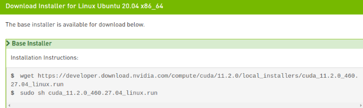
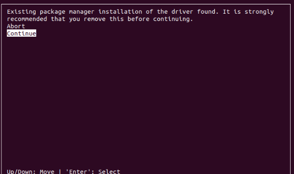
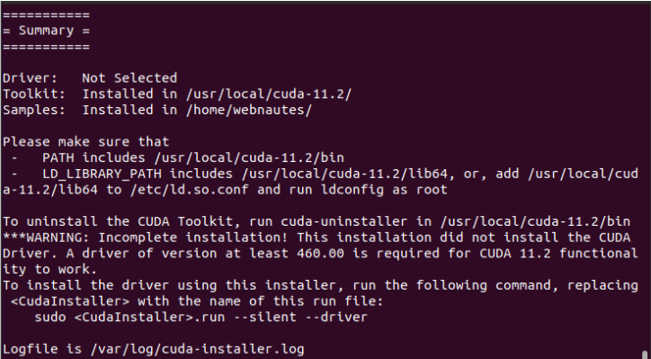
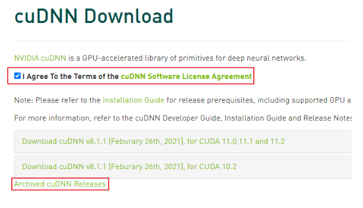

# AWS GPU 서버 설정


## 1. 그래픽 드라이버 설치
</br>

```
$ ubuntu-drivers devices
```
</br>

이후 드라이버 버전중 하나를 선택 하여 설치
</br>

```
$ sudo apt install nvidia-driver-570
```


</br>

## 2. cuda 11.2 설치
</br>

아래 링크에 접속하여 CUDA Toolkit 11.2를 선택
</br>

https://developer.nvidia.com/cuda-toolkit-archive

</br>

아래와 같이 선택

</br>


</br>

아래 명령어를 입력
</br>

</br>



</br>

명령어 실행 후 아래와 같은 창이 뜬다면

</br>

Continue 선택




</br>

다음처럼 에러가 난다면 gcc가 설치안되어 있는 상태 

</br>

 Failed to verify gcc version. See log at /var/log/cuda-installer.log for details.


</br>

개발을 위한 필수 프로그램을 설치하고 다시 실행

</br>

```
$ sudo apt-get install build-essential 
```

</br>
accept 입력 후, 엔터를 입력


</br>

Driver 항목에서 스페이스바 눌러서 체크 해제하고 , Install 항목에서 엔터를 입력</br>
(해당 사진은 Driver version이 460으로 표기 되지만 위에서 설치한 570에 맞춰서 설치)

</br>


</br>

문제 없이 설치되면 다음처럼 표기

</br>



</br>

다음 명령을 사용하여 CUDA Toolkit 관련 설정을 환경 변수에 추가하고  바로 적용

</br>

```
$ sudo sh -c "echo 'export PATH=$PATH:/usr/local/cuda-11.2/bin' >> /etc/profile"
$ sudo sh -c "echo 'export LD_LIBRARY_PATH=$LD_LIBRARY_PATH:/usr/local/cuda-11.2/lib64' >> /etc/profile"
$ sudo sh -c "echo 'export CUDADIR=/usr/local/cuda-11.2' >> /etc/profile"
$ source /etc/profile
```

</br>

설치가 잘되었는지 확인. 11.2 가 보여야 함

</br>

다음 명령어를 입력

</br>

```
$ nvcc -V
```

</br>

아래와 같이 보인다면 설치가 완료

</br>

```
nvcc: NVIDIA (R) Cuda compiler driver

Copyright (c) 2005-2020 NVIDIA Corporation

Built on Mon_Nov_30_19:08:53_PST_2020

Cuda compilation tools, release 11.2, V11.2.67

Build cuda_11.2.r11.2/compiler.29373293_0
```

</br>


## 3. cuDNN 8.1.0 설치

</br>

아래 링크에 접속

https://developer.nvidia.com/cudnn 

</br>
Download cuDNN을 클릭
</br>


</br>
계속 진행하려면 로그인 진행
</br>


</br>
라이센스에 동의한다고 체크하고( I Agree to the Terms of… ) 

Archived cuDNN Releases를 클릭 



</br>

목록에서 다음 항목을 클릭
</br>

```
Download cuDNN v8.1.0 (January 26th, 2021), for CUDA 11.0,11.1 and 11.2
```
</br>


다음 항목을 클릭 
</br>

```
cuDNN Library for Linux (x86_64)
```

</br>


다운로드 받은 파일을 압축풀어서 파일 복사

</br>

```
$ cd 다운로드

$ tar xvzf cudnn-11.2-linux-x64-v8.1.0.77.tgz

$ sudo cp cuda/include/cudnn* /usr/local/cuda/include

$ sudo cp cuda/lib64/libcudnn* /usr/local/cuda/lib64


$ sudo chmod a+r /usr/local/cuda/include/cudnn.h /usr/local/cuda/lib64/libcudnn*
```


</br>

링크를 다시 걸어줌

 </br>

```
$ sudo ln -sf /usr/local/cuda-11.2/targets/x86_64-linux/lib/libcudnn_adv_train.so.8.1.0 /usr/local/cuda-11.2/targets/x86_64-linux/lib/libcudnn_adv_train.so.8

$ sudo ln -sf /usr/local/cuda-11.2/targets/x86_64-linux/lib/libcudnn_ops_infer.so.8.1.0  /usr/local/cuda-11.2/targets/x86_64-linux/lib/libcudnn_ops_infer.so.8

$ sudo ln -sf /usr/local/cuda-11.2/targets/x86_64-linux/lib/libcudnn_cnn_train.so.8.1.0  /usr/local/cuda-11.2/targets/x86_64-linux/lib/libcudnn_cnn_train.so.8

$ sudo ln -sf /usr/local/cuda-11.2/targets/x86_64-linux/lib/libcudnn_adv_infer.so.8.1.0  /usr/local/cuda-11.2/targets/x86_64-linux/lib/libcudnn_adv_infer.so.8

$ sudo ln -sf /usr/local/cuda-11.2/targets/x86_64-linux/lib/libcudnn_ops_train.so.8.1.0  /usr/local/cuda-11.2/targets/x86_64-linux/lib/libcudnn_ops_train.so.8

$ sudo ln -sf /usr/local/cuda-11.2/targets/x86_64-linux/lib/libcudnn_cnn_infer.so.8.1.0 /usr/local/cuda-11.2/targets/x86_64-linux/lib/libcudnn_cnn_infer.so.8

$ sudo ln -sf /usr/local/cuda-11.2/targets/x86_64-linux/lib/libcudnn.so.8.1.0  /usr/local/cuda-11.2/targets/x86_64-linux/lib/libcudnn.so.8

```

</br>

새로 추가된 라이브러리를 시스템에서 찾을 수 있도록 하고 루트 디렉토리로 이동

</br>

```
$ sudo ldconfig

$ cd
```

</br>


설정이 제대로 되었는지 확인 ( 다음처럼 8.1.0이 표기되었는지 확인 )

</br>

```
$ ldconfig -N -v $(sed 's/:/ /' <<< $LD_LIBRARY_PATH) 2>/dev/null | grep libcudnn

libcudnn_adv_train.so.8 -> libcudnn_adv_train.so.8.1.0

libcudnn_adv_infer.so.8 -> libcudnn_adv_infer.so.8.1.0

libcudnn_ops_infer.so.8 -> libcudnn_ops_infer.so.8.1.0

libcudnn.so.8 -> libcudnn.so.8.1.0

libcudnn_ops_train.so.8 -> libcudnn_ops_train.so.8.1.0

libcudnn_cnn_train.so.8 -> libcudnn_cnn_train.so.8.1.0

libcudnn_cnn_infer.so.8 -> libcudnn_cnn_infer.so.8.1.0

```


