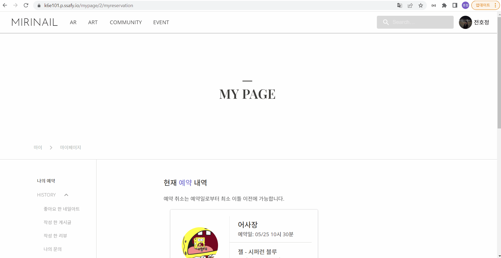
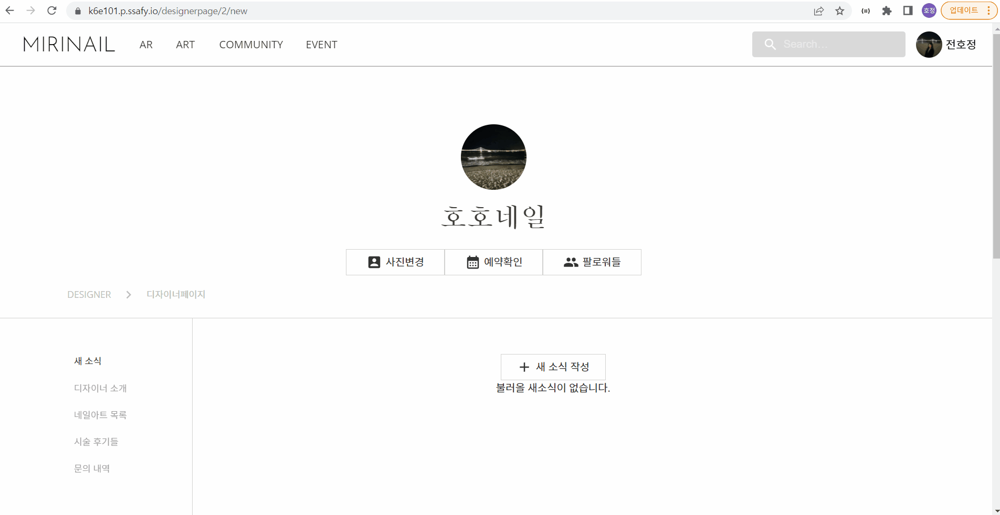

# 메인

 

## 메인페이지 

 

  

 

 ### 1. 메인 페이지에서는 인기 네일아트 및 디자이너, 유저들의 커뮤니티 페이지를 간략하게 볼 수 있다.

  

## 검색 ( NavBar )

 

  

 

### 1. 네브바의 검색창을 통해 디자이너를 검색 할 수 있다.
### 2. 검색한 디자이너의 페이지로 이동해 새소식, 문의 등을 할 수 있다.

  

# 네일아트

 

## 네일아트 목록
 

  

 

### 1. 네브바를 통해 네일아트 목록으로 이동 할 수 있다.
### 2. 이동한 초기 페이지는  네일아트 전체를 보여주고 페이지네이션을 통해 여러 네일아트를 볼 수 있다.
### 3. 위쪽은 타입별, 색상별 필터링을 통해 크게 분류 하여 볼 수 있다.
### 4. 타입별에서는 3가지 타입으로 나누어 볼 수 있으며 최신순 인기순으로 정렬이 가능하다.
### 5. 색상별에서는 12가지 색상으로 나누어 볼 수 있으며 최신순 인기순으로 정렬이 가능하다.

  

## 네일아트 상세
 

  

 

### 1. 위의 네일아트 목록에서 하나의 네일아트를 선택하여 상세보기를 할 수 있다.
### 2. 상세에서는 이름, 가격, 디자이너, 소개 등을 볼 수 있다.
### 3. AR 피팅하기를 통해 실제 나의 손톱에 네일아트를 올려 볼 수 있다.
### 4. 예약하기를 통해 원하는 날짜에 예약을 신청 할 수 있다.
### 5. 좋아요를 통해 마음에 드는 네일아트를 찜 할 수 있다.
### 6. 해당 디자이너의 다른 작품들을 볼 수 있다.
### 7. 해당 네일아트에 대한 리뷰를 확인 할 수 있다.
### 8. 해당 네일아트에 대해 1대1 문의를 할 수 있다.

  

## 네일아트 상세 - 예약

 

  

 

### 1. 상세에서 예약 버튼을 누르게 되면 예약 페이지로 이동한다.
### 2. 달력에서 원하는 날짜를 선택하면 해당 날짜중에 예약 할 수 있는 시간이 표기된다.
### 3. 표기된 날짜에서 예약가능한 네일아트를 선택하고 요청사항을 적은 뒤 예약이 가능하다.

  

## 네일아트 AR 피팅

 

  

 

### 1. 상세에서 AR 피팅하기 버튼을 누르면 네일아트 피팅 창이 뜬다.
### 2. 피팅 창에서 손을 올리게 되면 손톱을 인식하며 선택한 디자인의 이미지가 피팅된다.

  

# 디자이너 목록

 

  

 

### 1. 디자이너 목록은 테마별, 전체 보기로 나뉜다.
### 2. 테마별 보기에서는 인기, 최신, 평점 높은 순으로 디자이너를 볼 수 있다.
### 3. 전체 보기에서는 등록된 디자이너를 모두 볼 수 있다.
### 4. 두 페이지 모두 각 디자이너를 클릭해 해당 디자이너의 페이지로 이동 할 수 있다.

  

# 마이 페이지

 

## 유저 마이 페이지

 

  

 

### 1. 유저 마이페이지에서는 유저 본인의 기록을 볼 수 있다.
### 2. 예약 확인 페이지를 통해 본인이 예약한 예약들을 볼 수 있다.
### 3. 히스토리에서는 좋아요한 네일아트, 작성한 게시글, 작성한 리뷰, 문의 내역을 확인 할 수 있다.
### 4. 유저가 팔로우한 디자이너 목록을 확인 할 수 있다.

  

## 디자이너 등록

 

  

 

### 1. 유저 마이페이지에서 디자이너 등록을 진행 할 수 있다.
### 2. 등록시에는 디자이너명, 연락처, 주소를 입력하고 사업자 등록증을 첨부해 등록 신청을 할 수 있다.

  

# 디자이너

 

## 네일아트 등록

 

  

 

### 1. 네일아트 등록 시에는 썸네일 이미지, AR 이미지를 첨부 한다.
### 2. 기입 내용으로는 네일 타입, 색상, 세부색상, 가격, 소개글을 입력한다.
### 3. 등록 이후에는 블록체인 기술을 통해 ipfs 번호가 자동으로 등록된다.

  

## 새소식 작성

 

  

 

### 1. 새소식 작성에서는 디자이너가 글을 올려 해당 페이지를 보는 유저들에게 공지를 할 수 있다.
### 2. 등록시에는 제목 작성, 이미지( 다중 첨부 가능) 첨부, 글 내용 작성 이후에 등록 할 수 있다.

  

## 문의 내역

  

 

### 1. 문의 내역 페이지에서는 디자이너에게 들어온 문의 내역들을 확인 할 수 있다.
### 2. 들어온 문의에 대해서는 답변을 달 수 있다.

  

# 관리자

  

 

### 1. 관리자는 디자이너 인증 신청 목록에서 승인, 거절을 통해 디자이너로 등록 시키거나 거절 할 수 있다.

  

# 커뮤니티

 

  

 

### 1. 커뮤니티 페이지에서는 다른 유저들의 글을 확인 할 수 있다.
### 2. 올라온 글을 클릭해 댓글을 달아 소통 할 수 있다.
### 3. 작성하기 버튼을 통해 이미지를 올리고 글을 작성하여 소통 할 수도 있다.

